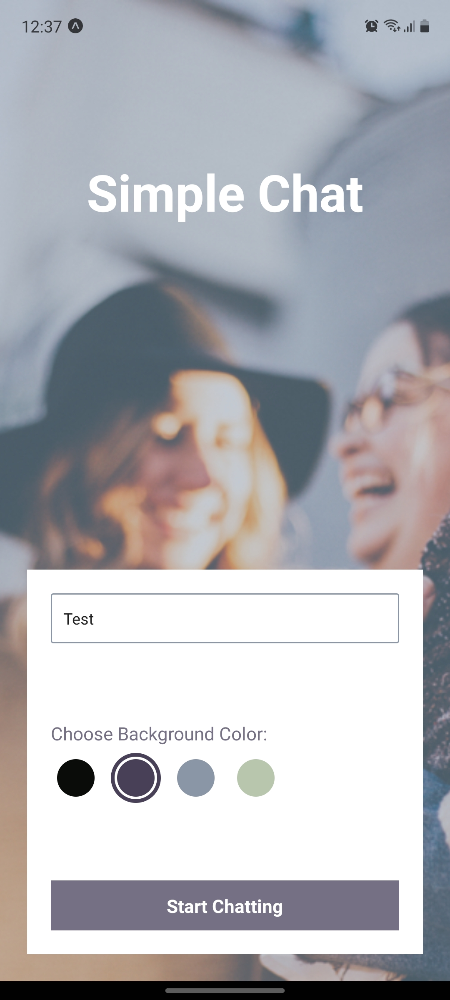
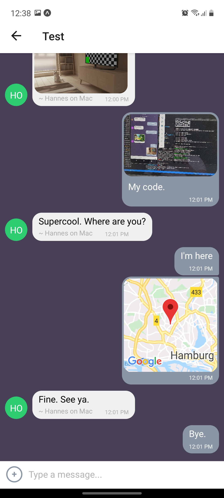

# Simple Chat

This is a real-time chat app built with React native. You can enter the chat without a registration and just start chatting.

    - 

# Functionality

- You can pick a custom background color and set your chat name
- You can send a pic
- You can take a pic and share it
- You can share your location
- The entire app is fully compatible with screen readers
- You can reread your chat timeline offline

# Technologies

- React native
- Javascript
- Firebase
- Expo
- Gifted Chat library

# Get started

## Prerequisites
- Node.js
- If you want to run the app on your device you also need the Expo app. It's available through your App store.

## Run the app
- First of all run:

        npm install

- The start the expo server:

        npm start

- scan QR code with your phone or press a (in the console) to start the app on Android studio or i to run it on an iOS simulator.